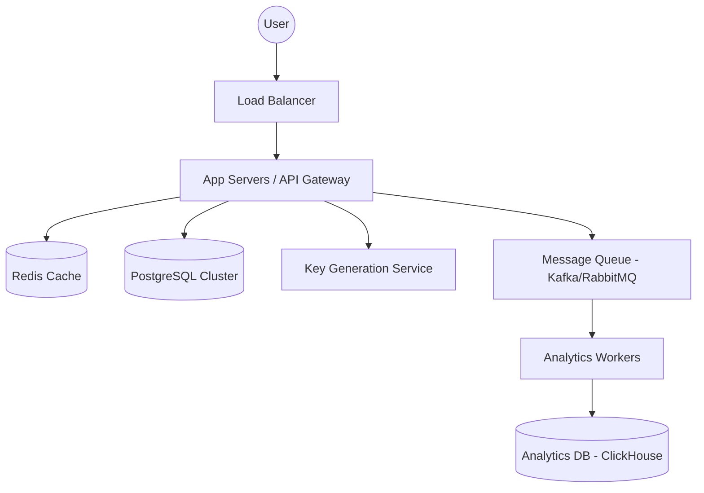

# High-Level Design: SnapLink URL Shortener

SnapLink is designed to be a highly available, scalable, and low-latency URL shortening service. This document outlines the architectural decisions and system design required to handle web-scale traffic (similar to Bitly).

## 1. Requirements

### Functional Requirements
*   **Shortening**: Given a long URL, the system should generate a shorter, unique alias.
*   **Redirection**: When a user accesses a short link, the system must redirect them to the original long URL with minimal latency.
*   **Custom Aliases**: Users should be able to specify a custom alias for their links.
*   **Analytics**: The system should track metrics such as click counts, geographic location, and referrer data.
*   **Expiration**: Support for links that expire after a certain period.

### Non-Functional Requirements
*   **High Availability**: The system must be available 24/7; downtime in redirection is unacceptable.
*   **Low Latency**: Redirection should happen in under 100ms.
*   **Scalability**: The system should handle 100 million new URLs per month and 10 billion redirects per month.
*   **Read-Heavy Nature**: Expected read-to-write ratio is 100:1.

---

## 2. Capacity Planning

### Traffic Estimates
*   **New URLs per month**: 100 Million
*   **New URLs per second**: ~40 per second
*   **Redirects per month**: 10 Billion
*   **Redirects per second**: ~4,000 per second

### Storage Estimates
*   **Long URL size**: ~500 bytes
*   **Short URL size**: ~50 bytes
*   **Metadata (Created at, User ID, Expiry)**: ~100 bytes
*   **Total per record**: ~650 bytes
*   **Monthly storage**: 100M * 650 bytes = 65 GB
*   **5-Year storage**: 65 GB * 60 months = ~3.9 TB

### Bandwidth Estimates
*   **Write bandwidth**: 40 req/s * 650 bytes = 26 KB/s
*   **Read bandwidth**: 4,000 req/s * 650 bytes = 2.6 MB/s

---

## 3. API Design

### POST `/api/v1/shorten`
Creates a short URL.
*   **Request**: `{"long_url": "...", "custom_alias": "...", "expiry": "..."}`
*   **Response**: `{"short_url": "...", "status": "success"}`

### GET `/{short_id}`
Redirects to the long URL.
*   **Response**: `HTTP 302 Found` with `Location` header.

### GET `/api/v1/analytics/{short_id}`
Returns analytics for a specific link.

---

## 4. High-Level Architecture

### Components Breakdown

#### 1. Key Generation Service (KGS)
To avoid collisions and runtime computation, a dedicated service pre-generates unique IDs (Base62). These IDs are stored in a "Key DB" and handed out to App Servers in batches (1,000 keys at a time) to minimize DB roundtrips.

#### 2. Redirection (The Read Path)
Since redirection is critical, we use a **Read-Aside Cache Strategy**:
1. Check Redis for the `short_id`.
2. If hit, return 302 immediately.
3. If miss, fetch from PostgreSQL, update Redis, and then return 302.

#### 3. Data Store
*   **PostgreSQL**: Used for link mappings. To scale, we implement **Horizontal Sharding** based on the `short_id` hash.
*   **Redis**: Used for caching "hot" links. Eviction policy: `LRU` (Least Recently Used).
*   **ClickHouse/NoSQL**: Dedicated to analytics to prevent heavy read/write analytical queries from impacting the core redirection performance.

#### 4. Analytics Pipeline
Analytics are processed asynchronously. When a click occurs, the Web Server pushes a message to a Queue. A worker consumes these messages and writes to the Analytics DB. This ensures the user's redirect isn't blocked by telemetry logging.

---

## 5. Security & Availability

*   **Rate Limiting**: To prevent abuse/spam, we implement per-IP rate limiting using Redis sliding windows.
*   **Replication**: PostgreSQL uses Multi-AZ replication (Master-Slave) to ensure no data loss and high availability.
*   **Cleanup**: A background job removes expired links periodically to reclaim storage.

---

## 6. Trade-offs & Decisions

*   **301 vs 302 Redirect**: We use **302 (Found)** for our redirects. While 301 (Permanent) is better for SEO, 302 ensures every click hits our servers, allowing us to capture accurate analytics.
*   **Base62 Encoding**: We use a 7-character string (62^7 = ~3.5 Trillion combinations), which is more than enough for our 5-year estimate of 6 Billion URLs.
